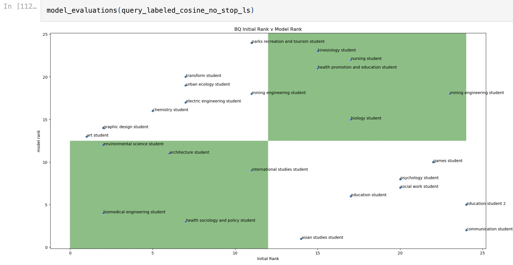

## Parsing apart a PDF file and then comparing parsed files to another document

The goal of this repository is to first separate documents that were combined in a single pdf based on keywords. Once parsed apart, each document was compared to another "source of truth" document using Natural Language Processing (NLP) and Machine Learning (ML) techniques. This comparison generated a ranking of how similar each document is to the "source of truth." The ranked scores were then compared to scores generated by human reviewers using correlation coefficients and visualized on a graph. 

The original intentions was to determine if NLP and ML models could predict which candidate got hired by comparing resumes to a job announcement. This respository uses sample data to demonstrate techniques used in the analysis.

Though none of the results were statistically significant, these notebooks demonstrate many techniques that could be used outside of a resume analysis, such as: 

1. Parsing apart any PDF file using a list of keywords. The accuracy of the parse is improved using Fuzzy Matching.
2. Using NLP techniques to prepare the text for modeling, including tokenization, stemming, lemmatization, and removal of stopwords.
3. Apply ML (though specifically NLP) models to determine similarity of each parsed text to the "source of truth." The specific models used were several varations of 1) Jaccard Similarity and 2) Term Frequency - Inverse Document Frequency (TFIDF) with consine similarity. 
4. Comparing a ranked list generated by the models basd on similarity to the "source of truth" with a ranked list generated by human reviewers using statistics, specifically correlation coefficients (Kendall, Spearman, and Pearson). 
5. Visualizing the similarity between the rankings generated by the models and those generated by the human reviewers using graphs.

This repository contains two Jupyter Notebooks: 

**A. Parse PDF by keyword GH.ipynb.**

*Inputs:*
1. A PDF file of template resumes downloaded from [The University of Utah](https://writingcenter.utah.edu/writing-resources/Resume%20Booklet.pdf) ("Resume Booklet.pdf").
2. An Excel file containing each name in the template resumes in a row in the same order as in the PDF file ("Resume Booklet names.xlsx").

*Output:* A dictionary where each key is a name of the resume and the value is the entire resume associated with that name. 

The code does the following: 
1. Extract all the resumes from the PDF file as one long string.
2. Reads in Excel file with the list of names as a pandas dataframe. Cleans and reorganizes the names so they match the name formating in the PDF file ("last name, first name &rarr; "first name last name").
3. Converts pandas dataframe with list of names into a list object. Formats all letters in the names to be lowercase.
4. Formats all words in the resume to be lowercase.
5. Uses Fuzzy Matching to pair the list of names with names from the resumes. The max Levenshtein distance is set to 6. Only the matched pair with the lowest Levenshtein score is kept. This addresses any descrepancies that may exist between how the names appear in the Excel file versus the actual resume. For example, if the Excel file had the name "Health, Society, and Policy Student" but it appears as "Health Sociology and Policy Student" in the Excel file, this fuzzy matching will update the list of names used to parse apart the resumes as "Health, Society, and Policy Student", resulting in a more accurate parse (approximately 10 percentage points in production).
6. Creates a dictionary object of the revised list of names where each key is a name and then it's assoicated value is the name following.
7. Converts to an ordered dictionary object in order to access the last name is the list.
8. Parses through the resume and attribute the text of the resume to the appropriate name using a for loop. Specifically, it starts at the first name (which is a key in the dictionary) and assigns all words following that name to the name in dictionary until it reaches the second name (which is the value associated with the key). It then stops and moves to the next name is the list and repeats the process.

**B. NLP and Machine Learning Modeling Resume Analysis GH.ipynb.**

*Inputs:*
1. Dictionary of parsed resumes (value) and assoicated names (key) generated by the "Parse PDF by keyword GH.ipynb" notebook ("parsed_middle_initial.pkl").
2. "Source of truth" pdf. For this example, it was a job description downloaded from a publicly available website ("108 Mgr Employment Equity - Brd Final 1.12.16.pdf").
3. Excel file with review scores from human reviewers ("BQ Matrix Resume Booklet.xls"). This was a sample file I created.

*Exports:* Many dataframes and graphs. The most valuable is a dataframe that contains the correlation coefficients and associated p-values for all the variations of the models that were completed. 

The code does the following:
1. Converts the dictionary of parsed names and resumes into a pandas dataframe.
2. Extracts the job description into a string.
3. Pulls in Excel files with scores from human reviewers and converts to a pandas dataframe. Formats the names so they match the names in the parsed names / resumes dataframe.
4. Formats the job description and parsed name/resumes dataframe (e.g. remvoing cid codes, keeping only necessary columns).
5. Processes the position description and parsed names/resumes df using NLP techniques (e.g. making words lowercase, removing stopwords, stemming, lemmatization, tokenization) to standardize the texts to allow for more accurate comparison.
6. Explores the data using NLP (e.g. calculating lexical diversity, most frequently used words, and frequency of modal verbs; reporting the most frequently used words and long words; calculating the number of times a word appears in each resume; reporting only the numbers or removing all the numbers).
7. Explores how different stemmers (Porter and Snowball) and lemmatization works using an example dataframe.
8. Compares each resume to the position description using Jaccard Similarity model (ML/NLP). This generates a score between -1 and 1 for each resume. The closer the score is to 0, the less similar the resume is to the position description. I repeated the model twice, first on resumes that were not stemmed and lemmatized and then on resumes that were. I then ranked the resumes by the scores.
9. Compares the ranks generated by each Jaccard Similarity model version with score provided by the human reviewers. I calculated correlation coefficients (Kendall, Spearman, and Pearson) and associated p-values between the two lists.
10. Graphs the two ranked lists (ranks generated by human reviewers v. ranks generated by models) to visually understand the data.
11. Repeats steps 8-10 using TFIDF and cosine similarity. Completed several variations of this model.
12. Plots jaccard similarity results and then TFIDF / cosine similarity scores with number of words. I expected to see less of a relationship between number of words and similarity scores wtih cosine similarity because cosine similarity is supposed to control for number of words more.
13. Explores the names package and how it can generate a list of names. 
14. Completes polyangulation of the various models to create an average ranking from several variations of the models.
15. Removes outliers using quantiles. Because the data set is so small, there is not enough data to demonstrate that "outliers" are truly outliers that should be removed. However, the code demonstrated that even with removing the outliers, the correlation coefficients remained not statistically significant. 

